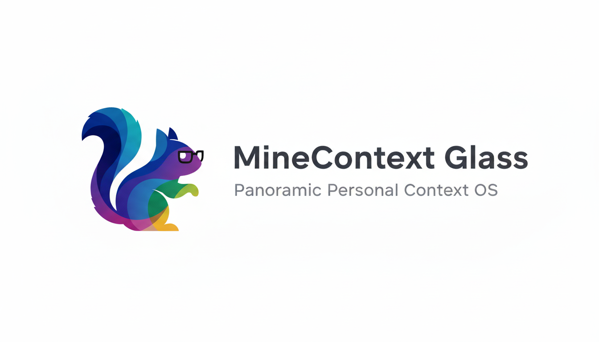

<div align="center">

<picture>
  
</picture>

### MineContext Glass: Full-Spectrum Personal Context OS

Built on ByteDance's [MineContext](https://github.com/volcengine/MineContext), extending the original open-source project into a glasses-first personal context platform.

</div>

<p align="center">
  <a href="README_zh.md">中文文档</a>
</p>

<p align="center">
  
  
  
  
</p>

## Vision

MineContext Glass reimagines personal context management around daily life. Using smart glasses, we capture day-long video streams and transform them into an organized, searchable knowledge base that bridges the physical and digital worlds. Every clip becomes part of a living memory system that powers summaries, reminders, and intelligent recommendations.

By standing on MineContext's mature context engineering foundations, we combine the existing cyberspace context (screen captures, documents, chats) with real-life visuals to create a full-spectrum, proactive assistant. The next milestone is speech recognition extracted from captured video audio, so conversations and spoken cues join the same context graph.

## Current Capabilities

- Continuous video ingestion from supported smart glasses, including automatic transfer, transcoding, and secure local storage.
- Adaptive frame sampling and embedding generation to distill long recordings into meaningful context snippets ready for retrieval.
- Unified context indexing that merges video-derived insights with the original MineContext knowledge base.
- Event and highlight surfacing that transforms raw clips into timelines, daily digests, and recall prompts.
- Doubao AUC Turbo transcription that turns audio tracks into aligned text segments without running heavyweight local models.

## Roadmap

| Status           | Milestone              | Description                                                                        |
| ---------------- | ---------------------- | ---------------------------------------------------------------------------------- |
| ✅ Completed     | Video capture pipeline | Daily video recording, compression, and context extraction are production-ready.   |
| ✅ Completed     | Speech recognition     | Doubao AUC Turbo transcription keeps voice context aligned with video timelines.  |
| 🧪 Planned       | Multimodal synthesis   | Fuse visual, audio, and digital signals into richer summaries and proactive tasks. |

## Quick Start

This repository keeps MineContext's developer tooling while adding the video processing stack.

### Prerequisites

- macOS or Linux with Python 3.9+.
- `uv` package manager (recommended) or a Python virtual environment.
- `ffmpeg` and `ffprobe` available on `PATH` (for example `brew install ffmpeg` on macOS).
- Optional: connected smart glasses with USB or Wi‑Fi file sync.

### Installation

```bash
uv sync
```

Or use a traditional virtual environment:

```bash
python -m venv .venv
source .venv/bin/activate
pip install -e .
```

### Configuration

1. Duplicate `config/config.yaml.example` (or your existing MineContext config) to `config/config.yaml`.
2. Set API keys, embedding models, and storage paths as needed.
3. Configure the Glass block so AUC Turbo credentials are available:

```yaml
glass:
  speech_to_text:
    provider: auc_turbo
    auc_turbo:
      base_url: https://openspeech.bytedance.com/api/v3
      resource_id: volc.bigasr.auc_turbo
      app_key: "${AUC_APP_KEY:}"
      access_key: "${AUC_ACCESS_KEY:}"
      request_timeout: 120
      max_file_size_mb: 100
      max_duration_sec: 7200
```

Credentials can live in the config file, environment variables, or be passed as CLI flags. See `glass/new_auc.md` for quotas, error codes, and troubleshooting tips.

### Start the Pipeline

Run the context server with:

```bash
uv run opencontext start --port 8000 --config config/config.yaml
```

Glasses footage dropped into the configured import path will be processed automatically. Use the CLI or API endpoints to inspect timelines, digests, and retrieved clips.

### Speech Recognition with AUC Turbo

1. Export the required credentials (or supply them via CLI flags):

   ```bash
   export AUC_APP_KEY=your-app-key
   export AUC_ACCESS_KEY=your-access-key
   ```

2. Launch the production pipeline against a specific date folder. The new `glass`
   entry point maps directly to the OpenContext CLI and processes everything under
   `videos/<dd-mm>/`:

   ```bash
   uv run glass start dd-mm --config config/config.yaml
   ```

   Results are written to the unified storage configured by `CONTEXT_PATH`, and
   timeline reports are collected under `persist/reports/dd-mm/`. Pass `--report-output`
   to override the destination directory or `--lookback-minutes` to adjust the window
   used for report generation.

### Generate Glass Reports

Once a timeline has been ingested, you can produce scoped summaries directly from the CLI:

```bash
uv run python -m opencontext.cli glass report \
  --timeline-id <timeline> \
  --lookback-minutes 120 \
  --output persist/reports/<timeline>.md
```

The report command reads the contexts persisted by the Glass timeline processor and writes Markdown files suitable for sharing.

### Frame-Only Ingest (Legacy)

If you only need frame extraction (for example, benchmarking embedding throughput), place raw `.mp4` files under `videos/<DATE>/` (such as `videos/2025-02-27/12-13.mp4`) and run:

```bash
uv run opencontext.tools.daily_vlog_ingest
```

This legacy tool extracts frames, updates the context store, and writes summaries to `persist/reports/<date>.md`. Speech recognition is no longer performed here; the Glass ingestion flow handles it through AUC Turbo when you process the resulting timelines.

## Architecture

MineContext Glass keeps the original context-flow of `context_capture → context_processing → storage → server routes`, expanding the capture stage with a dedicated video manager.

- **Video Capture Manager** (upcoming) pulls footage from smart glasses, handles deduplication, and writes raw assets to managed storage.
- **Video Processing Pipeline** extracts frames, runs embeddings, and forwards structured snippets into the context store.
- **Speech Recognition Layer** (AUC Turbo) transcribes audio tracks via Doubao AUC Turbo and attaches aligned text spans to the same timeline entries as their visual counterparts.
- **Unified Retrieval API** exposes both cyberspace and real-life context through a single search and recommendation surface.

Refer to `opencontext/` for CLI entry points, managers, storage adapters, and utilities; configuration files live under `config/`, while runtime data persists in `persist/` and `logs/`.

## Contributing

We welcome issues and pull requests focused on expanding context capture, improving retrieval, or polishing the smart glasses workflow. Please review `CONTRIBUTING.md` and follow the repository's testing and Conventional Commit guidelines.

## License

This project inherits the original MineContext license. See [LICENSE](LICENSE) for details.
