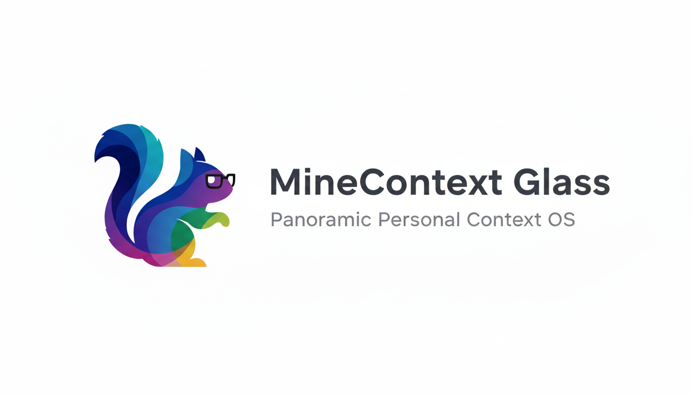

<div align="center">

<picture>
  
</picture>

### MineContext Glass：全景个人上下文操作系统

基于字节跳动的开源项目 [MineContext](https://github.com/volcengine/MineContext) 构建，将其扩展为以智能眼镜为核心的个人上下文平台。

</div>

## 目录

- [目录](#目录)
- [愿景](#愿景)
- [当前能力](#当前能力)
- [路线图](#路线图)
- [快速开始](#快速开始)
  - [环境依赖](#环境依赖)
  - [安装](#安装)
  - [配置](#配置)
  - [启动管线](#启动管线)
  - [日常 vlog 批处理](#日常-vlog-批处理)
- [架构总览](#架构总览)
- [参与贡献](#参与贡献)
- [许可证](#许可证)

## 愿景

MineContext Glass 以真实世界为原点重新想象个人上下文管理。通过智能眼镜捕捉每日生活视频，将长时间影像转化为结构化、可检索的知识库，在物理世界与数字世界之间建立桥梁。每一段视频都成为动态记忆系统的一部分，为总结、提醒和智能推荐提供燃料。

得益于 MineContext 成熟的上下文工程框架，我们把原有的赛博空间上下文（屏幕截图、文档、聊天记录等）与现实视觉融合，打造全面的主动式助手。下一步我们将完成视频语音识别，把镜头中的语音对话同步纳入同一套上下文图谱，实现真正的全模态个人记忆系统。

## 当前能力

- 支持主流智能眼镜的连续视频导入，自动完成拷贝、转码与本地安全存储。
- 自适应抽帧与向量嵌入，将长视频蒸馏为可检索的语义片段。
- 统一索引层把视频洞察与原 MineContext 数据库合并，实现跨模态检索。
- 事件与高光生成，把原始素材转化为时间线、日常摘要和回顾提示。

## 路线图

| 状态        | 里程碑             | 说明                                                   |
| ----------- | ------------------ | ------------------------------------------------------ |
| ✅ 已完成   | 视频采集与处理管线 | 支持日常视频录制、压缩与上下文抽取，已投入使用。       |
| 🛠️ 开发中 | 语音识别           | 提取视频音频中的语音，生成时间戳文本并写入上下文图谱。 |
| 🧪 计划中   | 多模态融合生成     | 联合视觉、语音与数字信号，产出更丰富的总结与主动任务。 |

## 快速开始

本仓库保留了 MineContext 的开发工具链，并新增视频处理能力。

### 环境依赖

- macOS 或 Linux，Python 3.9+。
- 建议使用 `uv` 包管理器，或手动创建虚拟环境。
- 可选：能够通过 USB 或 Wi‑Fi 同步文件的智能眼镜设备。

### 安装

```bash
uv sync
```

或使用传统虚拟环境：

```bash
python -m venv .venv
source .venv/bin/activate
pip install -e .
```

### 配置

1. 复制 `config/config.yaml.example`（或现有 MineContext 配置）为 `config/config.yaml`。
2. 根据需要填写 API 密钥、嵌入模型和存储路径。
3. 在新增的 `[video]` 配置段中，指定眼镜素材导入目录与转码策略。

### 启动管线

使用以下命令运行上下文服务器：

```bash
uv run opencontext start --port 8000 --config config/config.yaml
```

当智能眼镜素材同步到配置的导入路径后，管线会自动触发处理。可通过 CLI 或 API 查看时间线、摘要以及检索结果。

### 日常 vlog 批处理

将当日原始 `.mp4` 视频放入 `videos/<日期>/` 目录（如 `videos/2025-02-27/12-13.mp4`），然后执行：

```bash
uv run opencontext.tools.daily_vlog_ingest
```

脚本会抽帧、写入上下文并在 `persist/reports/<date>.md` 生成 Markdown 总结，可通过 `--date YYYY-MM-DD`、`--frame-interval 5` 等参数指定日期或抽帧间隔。

## 架构总览

MineContext Glass 延续原有的 `context_capture → context_processing → storage → server routes` 流程，并在捕获阶段新增视频管理模块。

- **视频捕获管理器(开发中)**：负责从智能眼镜拉取素材、去重并写入受管存储。
- **视频处理管线**：执行抽帧、生成嵌入，并将结构化片段写入上下文存储。
- **语音识别层（开发中）**：把音轨转为带时间戳的文本，附着到对应的时间线节点。
- **统一检索 API**：在同一入口提供赛博上下文与现实世界上下文的查询与推荐。

代码入口仍位于 `opencontext/` 目录；配置文件在 `config/`；运行时数据写入 `persist/` 与 `logs/`（请勿提交到版本库）。

## 参与贡献

欢迎通过 Issue 或 Pull Request 一同完善智能眼镜工作流、上下文捕获能力与检索体验。提交前请阅读 `CONTRIBUTING.md` 并遵循测试及 Conventional Commit 规范。

## 许可证

本项目继承 MineContext 的许可证，详情参见 [LICENSE](LICENSE)。
